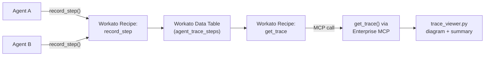
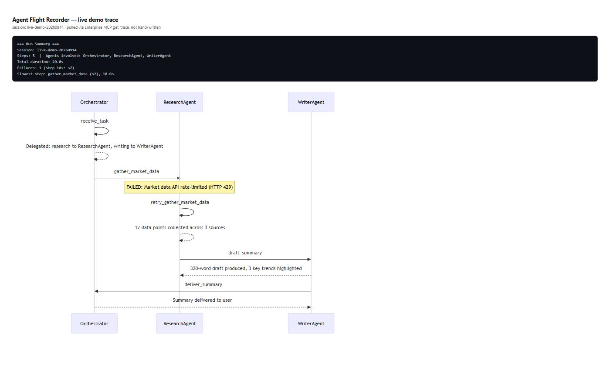

# Agent Flight Recorder

[](https://www.python.org/)
[](https://www.workato.com/mcp)
[](tests/test_trace_viewer.py)
[](LICENSE)
[](#whats-working-today)

An audit trail for multi-agent AI systems. When one agent hands work to
another, this records who did what, when, and whether it worked. When
something breaks in production, there's a real trace to look at instead
of a shrug.

```
python trace_viewer.py sample_data/sample_trace.json
```

```
=== Run Summary ===
Session: demo-run-001
Steps: 5  |  Agents involved: BillingAgent, Orchestrator, ProvisioningAgent
Total duration: 36.0s
Failures: 1 (step ids: s3)
Slowest step: add_seats (s3), 30.0s
```

...plus a Mermaid sequence diagram reconstructing the whole handoff chain,
including exactly where and why it failed.

## Why this, specifically

Three data points behind this:

- A widely-cited academic failure study (MAST) found **~79% of
  multi-agent failures** trace back to unclear task specs (42%) and
  agent-to-agent **coordination breakdowns** (37%): agents
  misunderstanding what another agent needed or expected.
- **72% of enterprise AI projects now use multi-agent architectures**
  (up from 23% in 2024), but observability is the *weakest*-rated part
  of the stack. Only 33% of teams are satisfied with it, and most
  tooling traces one agent at a time, not the handoff pattern across
  several.
- In LangChain's own survey, **quality/reliability is the #1 cited
  blocker** to running agents in production, ahead of latency or cost.

Teams can get agents to work in a demo. What's missing is the ability to
see, after the fact, exactly what a chain of agents actually did to each
other. That's what this is for.

## Architecture



Two tools, exposed as an MCP server via Workato's Enterprise MCP:

- **`record_step`**: any agent calls this after completing a step:
  who it is, what it did, what happened, and (via `parent_step_id`)
  who handed it the work.
- **`get_trace`**: pulls the full recorded sequence for a run, in
  the order it happened.

The recording side lives in Workato (a Data Table plus two API-triggered
recipes, see [`docs/BUILD_PLAN.md`](docs/BUILD_PLAN.md)). The *reading*
side, turning a trace into something a human can actually use, is
[`trace_viewer.py`](trace_viewer.py), which works standalone against
any trace matching the schema, Workato or not.

## Why rule-based, not an LLM summarizing the trace

It would be easy to pipe the recorded steps through an LLM and ask for a
narrative summary instead. This intentionally doesn't:

- An audit trail that itself hallucinates defeats the point. The one
  property this needs is that it says exactly what was logged, nothing
  invented.
- It has to work with zero added cost or latency on the debugging path,
  which is usually already the worst moment to be waiting on another
  model call.
- Deterministic parsing is trivially testable (see `tests/`); "does the
  LLM's summary accurately reflect the trace" is a much harder thing to
  verify and keep verified as the format evolves.

An LLM-written summary *on top of* the deterministic output is a
reasonable v2 (see Roadmap), but the source of truth stays rule-based.

## What's working today

- [x] Trace schema defined (`sample_data/sample_trace.json`)
- [x] `trace_viewer.py`: builds a Mermaid sequence diagram + run summary,
      7 passing unit tests
- [x] Data Table + `record_step`/`get_trace` recipes built in Workato,
      both live
- [x] Exposed via Enterprise MCP (`agent-flight-recorder` server, both
      tools active, see `docs/screenshots/mcp_server_active.jpg`)
- [x] Fed a real (not hand-written) multi-agent trace: a 3-agent,
      5-step run (with a failure + retry) recorded live through the
      Enterprise MCP server and pulled back with `get_trace`
      (`sample_data/live_demo_trace.json`)
- [x] Screenshots / demo added to `docs/screenshots/`

## Live demo

A real run, not a fixture, recorded through the live `record_step` MCP
tool and read back with `get_trace`: `Orchestrator` delegates research,
`ResearchAgent` hits a rate limit and retries, `WriterAgent` drafts a
summary, `Orchestrator` delivers it.

```
python trace_viewer.py sample_data/live_demo_trace.json
```



## Try it

```bash
python -m unittest discover -s tests   # 7 tests, no dependencies
python trace_viewer.py sample_data/sample_trace.json
```

## Roadmap

**v0**: trace schema, `trace_viewer.py`, sample data, tests. The
reading/analysis side, fully working standalone.

**v1 (this repo, today)**: the recording side live in Workato: Data
Table, `record_step` / `get_trace` recipes, exposed via Enterprise MCP;
fed a real multi-agent run instead of fixture data.

**v2**: an optional LLM-narrated summary layered on top of the
deterministic trace (see "Why rule-based" above); anomaly flagging
(a step that's an outlier vs. that agent's historical duration); a
minimal web view instead of a CLI dump.

## Project layout

```
agent-flight-recorder/
├── README.md
├── trace_viewer.py          # trace -> diagram + summary (done, tested)
├── sample_data/
│   └── sample_trace.json    # example run: a step fails, retries, succeeds
├── tests/
│   └── test_trace_viewer.py
├── recipe/                  # exported Workato project (wk clone), the
│                             # real record_step/get_trace/data table/MCP defs
├── docs/
│   ├── BUILD_PLAN.md        # step-by-step: Data Table + recipes + MCP exposure
│   └── screenshots/
└── LICENSE
```
